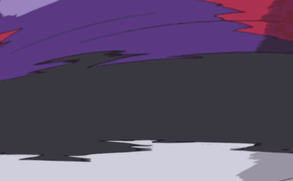

# Pokemon Pixel Fanart Display  

A display of pixel fanart, of various items and Pokemon from Pokemon!  

## Usage  

TODO: Write usage instructions  

## Contributing  

1. Fork it!
2. Create your feature branch: `git checkout -b my-new-feature`  
3. Commit your changes: `git commit -am 'Add some feature'`  
4. Push to the branch: `git push origin my-new-feature`  
5. Submit a pull request :D  

## History

01/15/22- Created the initial setup  
01/19/22- Added svg assets to html, styled the HTML  
01/20/22- Styled the HTML more, optimized svgs
01/21/22- Finished the styling

## Credits  

Singer, Dan- Author  

Reference of sprites from: https://bulbapedia.bulbagarden.net/wiki/Main_Page  
Readme Image Credit: https://funnyjunk.com/channel/pokemon/Thatd+ing+piss+me+off/lzpYMym/ 
<a target="_blank" href="https://icons8.com/icon/118497/facebook">Facebook</a> icon by <a target="_blank" href="https://icons8.com">Icons8</a>
<a target="_blank" href="https://icons8.com/icon/32323/instagram">Instagram</a> icon by <a target="_blank" href="https://icons8.com">Icons8</a>
<a target="_blank" href="https://icons8.com/icon/13963/twitter">Twitter</a> icon by <a target="_blank" href="https://icons8.com">Icons8</a>

All images used are recreations made for educational purposes only. The images are copyrighted or is a registered trademark. The contributor claims fair use. No copyright infringement is intended.  

Certain materials are included under fair use exemption of the U.S. Copyright Law and are restricted from further use.  

© 2023 Pokémon. © 1995–2023 Nintendo/Creatures Inc./GAME FREAK inc.  

## License  

MIT  

